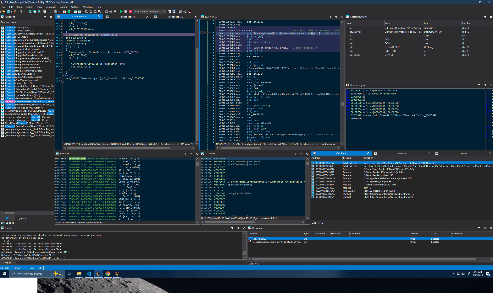

<div align="right">

[](https://github.com/e7ite/FateHacks/actions/workflows/ci.yml)

</div>

# FateHacks

This is a reverse-engineering project for the FATE game on Steam. This project will produce a DLL file that can be injected into the game using your favorite cheat injector

## Features
- An in-game cheat menu. Press Insert to open or close it, Backspace to go back a level (or close it at the root), and left-click a row to activate it.
  - Add Gold: gives 100 gold.

## Project layout
- `dllmain.cpp` -- the DLL's entry point. Installs the detours on load.
- `client.{hpp,cpp}` -- the game's top-level objects and the detours that drive the cheat menu each frame.
- `menu.{hpp,cpp,_test.cpp}` -- the cheat menu itself: navigation, checking clicks, and rendering. Game-independent and unit tested (see Testing below).
- `render.{hpp,cpp}` -- rendering resources bound to the game's Direct3D device.
- `input.{hpp,cpp}` -- the game's keyboard and mouse handlers.
- `stl.{hpp,cpp}` -- bindings to the game's own STL-like containers, since the game's compiled `std::string`/`std::vector` layout doesn't match this DLL's compiler.
- `detour.{hpp,cpp}` -- a thin, game-independent wrapper around Microsoft Detours.
- `abi.hpp` -- low-level helpers for calling into the game's own code.
- `test_main.cpp` -- the test binary's entry point. Runs every test suite linked into it.

## Design
The cheat menu is built to be tested without the game running. Anywhere it needs something from the game -- triggering a cheat, measuring text -- it goes through a small interface instead of talking to the game directly. We implement the real game objects through these interfaces; tests substitute test doubles for them instead, so the menu's navigation and logic can run and be checked without the actual game object. Only rendering touches the game directly.

## Testing
Tests use Google Test/Google Mock, installed via [vcpkg](https://github.com/microsoft/vcpkg) (`vcpkg install gtest:x86-windows-static-md`). Build and run them with:
```
msbuild FateHacks\FateHacksTests.vcxproj /p:Configuration=Debug /p:Platform=Win32
```
This links Google Test/Mock statically, so the test binary just runs on its own. The build runs the suite automatically afterward, so a non-zero exit means a test failed.

A pre-commit hook (`.githooks/pre-commit` -- run `git config core.hooksPath .githooks` once to enable it) runs this same build before every commit and blocks it if a test fails. CI (badge above) runs it on every push and pull request too.

The project follows the Google C++ style guide (`.clang-format`); run `clang-format` on any file you touch before committing.

## Usage
1. Obtain [Microsoft Detours](https://github.com/microsoft/Detours) using [vcpkg](https://github.com/microsoft/vcpkg)
1. Build `FateHacks/FateHacks.vcxproj` using VS 2022 (other VS versions may work, I have not attempted them). I currently build the project on Debug x86 settings.
2. If compiled with Debug settings, navigate to the Debug/ directory to obtain the DLL created.
3. Inject with your favorite DLL injector.

If you use VS Code instead, `Ctrl+Shift+B` runs `.vscode/build.ps1`, which unloads the previously injected DLL, builds, and injects the new one in one step.

## Debugging with IDA

The Debug build emits a full standalone PDB (`Debug/FateHacks.pdb`) so IDA can resolve this DLL's symbols while debugging the injected module. To load them:

1. Build and inject a matching DLL. A rebuild changes the PDB signature, so the injected DLL must be the one that produced the current PDB.
2. Attach IDA's Local Windows debugger to `fate.exe`. Use only one debugger at a time -- do not also attach Visual Studio to the same process.
3. Open `Debugger` -> `Debugger windows` -> `Module list`, find `FateHacks.dll`, right-click it and choose **Load debug symbols**.

The detour trampoline (shown as `JUMPOUT(0x...)` inside the game's `CGameUI::Render`) and any source breakpoints in `dllmain.cpp` will now resolve to named functions. Re-run step 3 after each rebuild, since the new PDB has a fresh signature.



# Dependencies
- [Microsoft Detours](https://github.com/microsoft/Detours)
- [Google Test/Google Mock](https://github.com/google/googletest) -- only needed to build/run the test project, not the DLL.